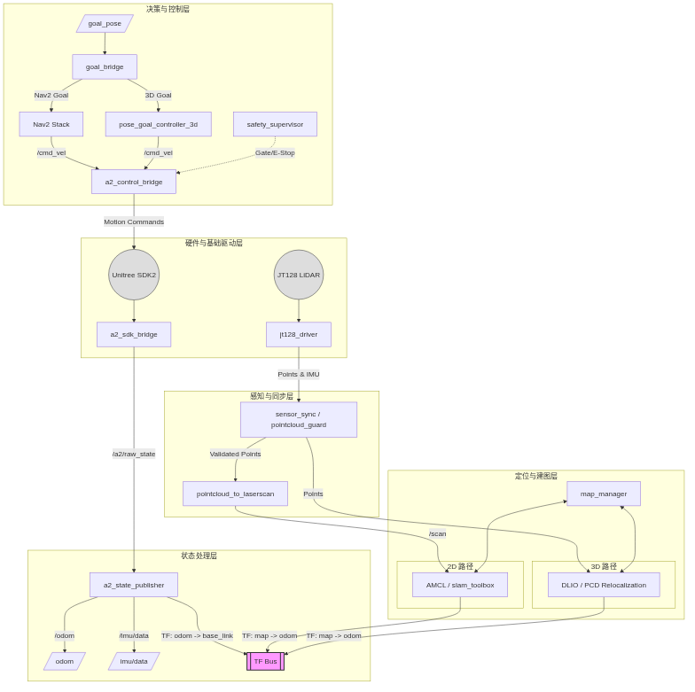

# A2 System Workspace



Host-side ROS 2 Humble workspace for the Unitree A2 real robot stack. The active baseline is front-LiDAR real deployment, with JT128 plus DLIO plus 3D relocalization as the current 3D path and AMCL as the default 2D localization path.

## Quick Start

如果你现在只关心真机启动顺序，先看：

- [README_A2_Quickstart.md](./README_A2_Quickstart.md)

## Build

```bash
cd /home/dell/a2_system_ws
source /opt/ros/humble/setup.bash
colcon build --symlink-install
```

## Active Bringup Entrypoints

通用真机 bringup：

```bash
cd /home/dell/a2_system_ws
source /opt/ros/humble/setup.bash
source install/setup.bash
ros2 launch a2_bringup bringup.launch.py network_interface:=enx00e099003cd7
```

JT128 + DLIO 建图：

```bash
ros2 launch a2_bringup dlio_mapping.launch.py
```

JT128 3D PCD 导航：

```bash
ros2 launch a2_bringup jt128_3d_navigation.launch.py map_id:=<saved_map_id>
```

Nav2 2D 导航：

```bash
ros2 launch a2_bringup bringup.launch.py \
  network_interface:=enx00e099003cd7 \
  enable_nav2_bringup:=true \
  real_localization_mode:=amcl \
  map:=/home/dell/a2_system_ws/runtime/maps/<map_id>/map.yaml
```

## Core Docs

- `src/a2_system/docs/architecture.md`
- `src/a2_system/docs/interface_contracts.md`
- `src/a2_system/docs/operations_runbook.md`
- `src/a2_system/docs/scan_mission.md`

## Real Bringup Preparation

1. Edit `src/a2_system/config/a2_sdk.yaml`
2. Edit `src/a2_system/config/motion_limits.yaml`
3. Edit `src/a2_system/config/network.yaml`
4. Confirm `src/a2_system/config/real_lidar.yaml`
5. Confirm the target wired interface name passed to bringup

## Useful Commands

```bash
python3 src/a2_system/scripts/preflight_check.py --config-dir src/a2_system/config
ros2 service call /map_manager/set_mode a2_interfaces/srv/SetMode "{mode: navigation}"
ros2 service call /map_manager/manage_map a2_interfaces/srv/ManageMap "{command: list, map_id: ''}"
install/a2_system/share/a2_system/configure_real_network.sh enx00e099003cd7
source install/a2_system/share/a2_system/setup_unitree_dds.sh enx00e099003cd7
install/a2_system/share/a2_system/start_real_stack.sh enx00e099003cd7
install/a2_system/share/a2_system/start_jt128_dlio_mapping.sh
install/a2_system/share/a2_system/start_jt128_3d_stack.sh
install/a2_system/share/a2_system/record_bag.sh
install/a2_system/share/a2_system/record_jt128_bag.sh
install/a2_system/share/a2_system/collect_logs.sh
```
