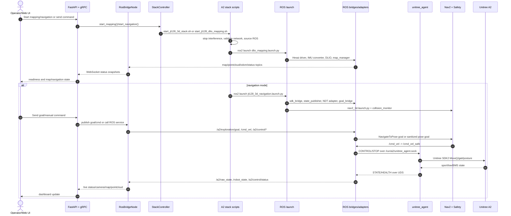

# Stack and Bridge Inventory

Generated from the current repository layout on 2026-05-18.

## Counts

| Item | Count | Scope |
|---|---:|---|
| ROS packages | 27 | `src/*/package.xml` |
| CMake/`rclcpp` packages | 10 | `src/*/CMakeLists.txt` |
| Python/`rclpy` packages | 15 | `src/*/setup.py` |
| Launch files | 29 | `src/**/launch/*.py` |
| A2 shell entrypoints | 17 | `src/a2_system/tools/*.sh` |
| Bridge-like source/config files | 17 | filenames matching bridge/relay/adapter/converter/broadcaster, excluding tests/cache/media |

## Technical Stacks

| Stack | Main tech | Primary files |
|---|---|---|
| ROS 2 host autonomy | ROS 2 Humble, `rclpy`, `rclcpp`, launch, Nav2, TF | `src/a2_bringup`, `src/a2_system`, `src/*/package.xml` |
| Real 3D mapping | Hesai JT128, DLIO, OctoMap, map manager | `src/a2_system/tools/start_jt128_dlio_mapping.sh`, `src/a2_bringup/launch/dlio_mapping.launch.py` |
| Real 3D navigation | JT128 + DLIO base, pointcloud map loader, Autoware NDT, Nav2 3D, collision monitor, Unitree control | `src/a2_system/tools/start_jt128_3d_stack.sh`, `src/a2_bringup/launch/jt128_3d_navigation.launch.py`, `src/a2_bringup/launch/nav2_3d.launch.py` |
| Legacy 2D navigation | SLAM toolbox/AMCL/Nav2 2D fallback, pointcloud-to-laserscan | `src/a2_bringup/launch/bringup.launch.py`, `src/a2_bringup/launch/legacy/*.launch.py`, `src/a2_system/config/nav2_stack.yaml` |
| Safety and readiness | Safety supervisor, real readiness monitor, lidar guard, NDT health monitor | `src/safety_manager`, `src/sensor_sync`, `src/localization_manager` |
| Web control plane | FastAPI, Uvicorn, WebSocket, gRPC, ROS client node | `web_console/backend/main.py`, `web_console/backend/ros_bridge.py`, `web_console/backend/grpc_server.py` |
| Web frontend | React 18, TypeScript, Vite, Three.js | `web_console/frontend/package.json`, `web_console/frontend/src` |
| Container deployment | Docker multi-stage build, Docker Compose, ROS Humble base image, Node build image | `Dockerfile`, `docker-compose.a2.yml`, `entrypoint.sh` |
| Simulation/validation | Gazebo/RViz, kinematics simulator, perception validation scripts | `src/a2_bringup/launch/*gazebo*`, `src/kinematics_sim`, `src/a2_system/scripts/sim_validate_*` |
| Diagnostics | `diagnostic_msgs`, status parser/adapter, health monitor | `src/a2_diagnostics`, `src/nav_health_monitor` |

## Runtime Stacks

| Runtime stack | Entry point | Core chain |
|---|---|---|
| Docker auto | `entrypoint.sh`, `docker-compose.a2.yml` | map exists -> 3D navigation; no map -> JT128/DLIO mapping; standby -> Web only |
| Web console | `web_console/backend/main.py` | FastAPI/gRPC/WebSocket -> `RosBridgeNode` -> ROS topics/actions/services |
| JT128/DLIO mapping | `start_jt128_dlio_mapping.sh` | network validation -> Hesai driver -> IMU SI converter -> DLIO odom/map -> OctoMap -> `map_manager` |
| JT128 3D navigation | `start_jt128_3d_stack.sh --mode navigation` | mapping base -> pointcloud map loader -> NDT adapter -> Nav2 3D -> collision monitor -> control bridge |
| Host bringup | `a2_bringup/launch/bringup.launch.py` | SDK/state/control/safety + optional sensors, SLAM, localization, Nav2, exploration |
| Nav2 3D sub-stack | `a2_bringup/launch/nav2_3d.launch.py` | traversability bridge -> goal bridge -> map server -> Nav2 navigation launch |
| Scan mission | `a2_bringup/launch/scan_mission.launch.py` / included in 3D navigation | `task_manager` -> `/run_mission` -> `auto_scan_mission` -> Nav2 goals/recovery |
| Diagnostics | `a2_diagnostics/launch/diagnostics.launch.py` | status adapters/aggregator -> `/diagnostics` -> health monitor |

## Bridge Components

| Bridge | Direction | Notes |
|---|---|---|
| `unitree_agent` | Unitree SDK/DDS <-> local IPC | Non-ROS process; only owner of Unitree SDK2 and `libddsc.so.0` |
| `a2_sdk_bridge_node` | UDS state stream -> ROS | Publishes `/a2/raw_state`, `/a2/sdk/status`, `/a2/battery` |
| `a2_light_bridge_node` | ROS -> UDS light command | Consumes `a2_interfaces/msg/LightCommand` and forwards through `unitree_agent` |
| `a2_control_bridge_node` | ROS/Nav2 -> UDS control command | Applies safety gates and limits, consumes `/cmd_vel_safe` or `/cmd_vel`, publishes control status/state |
| `a2_state_publisher_node` + `state_bridge.yaml` | raw robot state -> normalized ROS state/TF | Converts `/a2/raw_state` into `/robot_state`, `/odom`, IMU, joint state, TF |
| `goal_bridge` | exploration/UI goals -> Nav2 action or pose topic | Converts `/a2/exploration/goal` into `/navigate_to_pose` or `/a2/nav3/goal_pose` |
| `RosBridgeNode` | Web/FastAPI/gRPC -> ROS graph | Subscribes to map/pose/status/camera/pointcloud topics and publishes commands/goals |
| `GrpcServer` | external gRPC -> Web stack controller/RosBridge | Exposes device/navigation/light services using generated protobuf stubs |
| `status_adapter_node` | status String -> `diagnostic_msgs` | Converts parseable status topics into `/diagnostics` |
| `a2_ndt_adapter` | Autoware NDT -> A2 localization contract | Owns `/a2/relocalization/pose` and `/a2/relocalization/status` path |
| `native_map_relay` | native/legacy map output -> canonical map | Provides map relay compatibility for legacy 2D paths |
| `pointcloud_relay` | pointcloud source -> guarded/synchronized pointcloud | Sensor sync relay utility |
| `pointcloud_to_laserscan` | 3D pointcloud -> 2D scan | Legacy 2D SLAM/Nav2 compatibility |
| `traversability_to_obstacle_cloud.py` | traversability grid -> obstacle pointcloud | Feeds local obstacles into Nav2/collision workflows |
| `odometry_to_pose_covariance.py` | odometry -> pose-with-covariance | Autoware NDT initial guess bridge when enabled |
| `odometry_tf_broadcaster.py` | odometry -> TF | Publishes flattened `odom -> base_link`; enabled by default in `dlio_mapping.launch.py` (`start_flattened_odom_tf:=true`); disabled automatically when OctoMap is active so that `octomap_mapping_node` (in `octomap_mapping.launch.py`) owns the full 3D TF |
| `imu_to_si_converter.py` | raw lidar IMU units -> SI IMU | Normalizes JT128 IMU input for DLIO |

## Main Sequence

